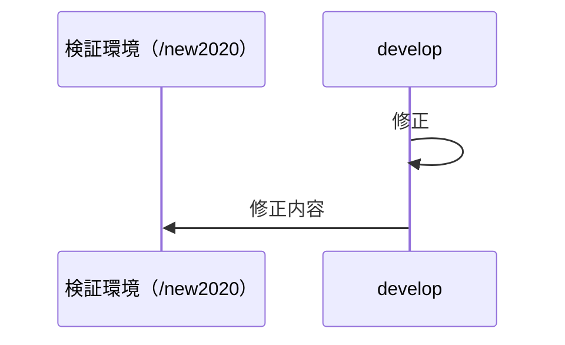
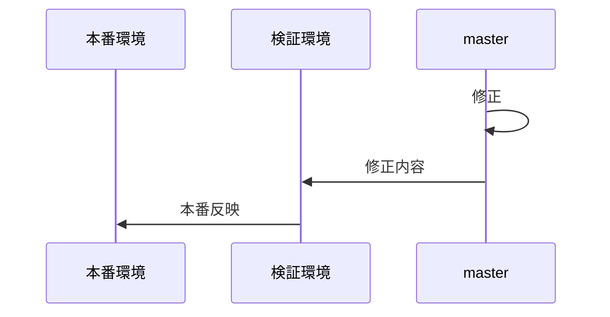
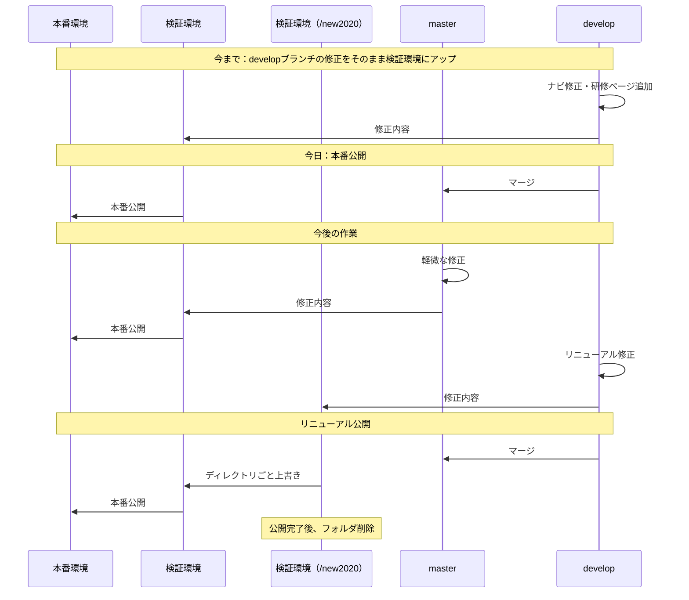

## 今後

#### フォルダ構成

```
iret
 |recruit2020
 |new-recruit2020（リニューアル作業アップ用）
```

#### リニューアル作業
developブランチから修正用のブランチを切って作業。
検証環境アップは「/new2020」ディレクトリを利用。



#### その他の軽微・即時公開の修正
masterブランチから直接、修正用のブランチを切って作業。
検証環境アップは「/2020」ディレクトリを利用。



## 全体図

